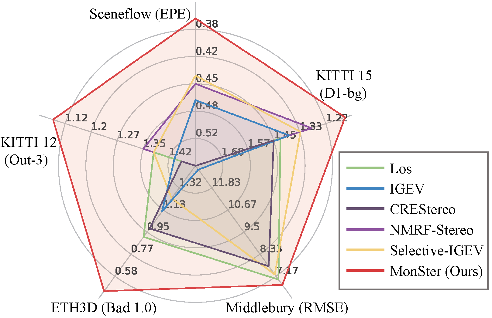
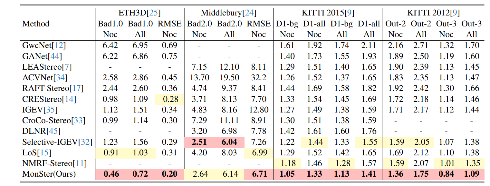
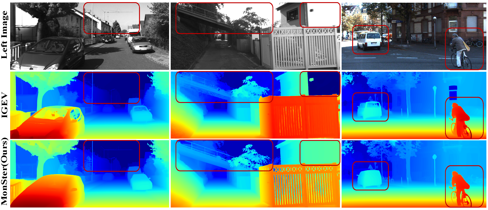

# 🚀 MonSter (CVPR 2025) 🚀
**Official PyTorch implementation of MonSter**   
[MonSter: Marry Monodepth to Stereo Unleashes Power](https://arxiv.org/abs/2501.08643)
Junda Cheng, Longliang Liu, Gangwei Xu, Xianqi Wang, Zhaoxing Zhang, Yong Deng, Jinliang Zang, Yurui Chen, Zhipeng Cai, Xin Yang  

##  🌼 Abstract
MonSter represents an innovative approach that effectively harnesses the complementary strengths of monocular depth estimation and stereo matching, thereby fully unlocking the potential of stereo vision. This method significantly enhances the depth perception performance of stereo matching in challenging regions such as ill-posed areas and fine structures. Notably, MonSter ranks first across five of the most widely used leaderboards, including SceneFlow, KITTI 2012, KITTI 2015, Middlebury, and ETH3D. Additionally, in terms of zero-shot generalization, MonSter also significantly and consistently outperforms state-of-the-art methods, making it the current model with the best accuracy and generalization capabilities.

##  📝 Benchmarks 

## :art: Qualitative Results

