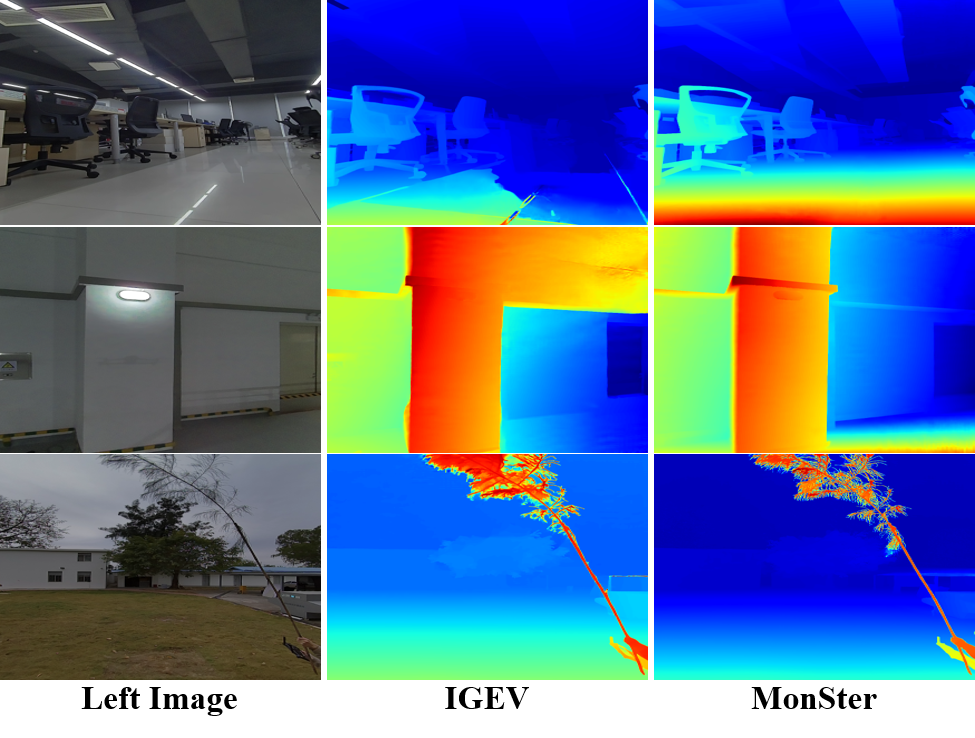

# 🚀 MonSter (CVPR 2025 Highlight) 🚀 

<p align="center">
</p>
<h2>🤗 Demo Video：</h2>
<div align="center">
	<a href="https://www.youtube.com/watch?v=u-UhFMGmXro">
		
	</a>
</div>
<p></p>

<div align="center">

</div>
MonSter: Marry Monodepth to Stereo Unleashes Power. <a href="https://arxiv.org/abs/2501.08643"></a>

Junda Cheng, Longliang Liu, Gangwei Xu, Xianqi Wang, Zhaoxing Zhang, Yong Deng, Jinliang Zang, Yurui Chen, Zhipeng Cai, Xin Yang <br/>

##  🌼 Abstract
MonSter is an innovative approach that effectively harnesses the complementary strengths of monocular depth estimation and stereo matching, thereby fully unlocking the potential of stereo vision. It significantly enhances the depth perception performance of stereo matching in challenging regions such as ill-posed areas and fine structures. Notably, MonSter ranks first across five of the most widely used leaderboards, including SceneFlow, KITTI 2012, KITTI 2015, Middlebury, and ETH3D. Additionally, in terms of zero-shot generalization, MonSter also significantly and consistently outperforms state-of-the-art methods, making it the current model with the best accuracy and generalization capabilities.

## ✅ TODO List

- [x] The real-time version of MonSter.
- [x] Mobile-friendly versions of MonSter (e.g. drones).
- [x] The multi-view version of MonSter (MVS). 

## 🌈: Zero-shot performance on KITTI

Zero-shot generalization performance on KITTI benchmark.

  
video demo

## :art: Zero-shot performance on the wild captured stereo images

Zero-shot generalization performance on our captured stereo images.

##  📝 Benchmarks performance


Comparisons with state-of-the-art stereo methods across five of the most widely used benchmarks.


## ⚙️ Installation
* NVIDIA RTX 3090
* python 3.8

### ⏳ Create a virtual environment and activate it.

```Shell
conda create -n monster python=3.8
conda activate monster
```
### 🎬 Dependencies

```Shell
pip install torch==2.0.1 torchvision==0.15.2 torchaudio==2.0.2 --index-url https://download.pytorch.org/whl/cu118
pip install tqdm
pip install scipy
pip install opencv-python
pip install scikit-image
pip install tensorboard
pip install matplotlib 
pip install timm==0.6.13
pip install mmcv==2.1.0 -f https://download.openmmlab.com/mmcv/dist/cu118/torch2.1/index.html
pip install accelerate==1.0.1
pip install gradio_imageslider
pip install gradio==4.29.0

```

## ✏️ Required Data

* [SceneFlow](https://lmb.informatik.uni-freiburg.de/resources/datasets/SceneFlowDatasets.en.html)
* [KITTI](https://www.cvlibs.net/datasets/kitti/eval_scene_flow.php?benchmark=stereo)
* [ETH3D](https://www.eth3d.net/datasets)
* [Middlebury](https://vision.middlebury.edu/stereo/submit3/)
* [TartanAir](https://github.com/castacks/tartanair_tools)
* [CREStereo Dataset](https://github.com/megvii-research/CREStereo)
* [FallingThings](https://research.nvidia.com/publication/2018-06_falling-things-synthetic-dataset-3d-object-detection-and-pose-estimation)
* [InStereo2K](https://github.com/YuhuaXu/StereoDataset)
* [Sintel Stereo](http://sintel.is.tue.mpg.de/stereo)
* [HR-VS](https://drive.google.com/file/d/1SgEIrH_IQTKJOToUwR1rx4-237sThUqX/view)

## ✈️ Model weights

| Model      |                                               Link                                                |
|:----:|:-------------------------------------------------------------------------------------------------:|
| KITTI (one model for both 2012 and 2015)| [Download 🤗](https://huggingface.co/cjd24/MonSter/resolve/main/kitti.pth?download=true) |
| Middlebury | [Download 🤗](https://huggingface.co/cjd24/MonSter/resolve/main/middlebury.pth?download=true)|
|ETH3D | [Download 🤗](https://huggingface.co/cjd24/MonSter/resolve/main/eth3d.pth?download=true)|
|sceneflow | [Download 🤗](https://huggingface.co/cjd24/MonSter/resolve/main/sceneflow.pth?download=true)|
|mix_all (mix of all datasets) | [Download 🤗](https://huggingface.co/cjd24/MonSter/resolve/main/mix_all.pth?download=true)|

The mix_all model is trained on all the datasets mentioned above, which has the best performance on zero-shot generalization.


## ✈️ Evaluation

To evaluate the zero-shot performance of MonSter on Scene Flow, KITTI, ETH3D, vkitti, DrivingStereo, or Middlebury, run

```Shell
python evaluate_stereo.py --restore_ckpt ./pretrained/sceneflow.pth --dataset *(select one of ["eth3d", "kitti", "sceneflow", "vkitti", "driving"])
```
or use the model trained on all datasets, which is better for zero-shot generalization.
```Shell   
python evaluate_stereo.py --restore_ckpt ./pretrained/mix_all.pth --dataset *(select one of ["eth3d", "kitti", "sceneflow", "vkitti", "driving"])
```

## ✈️ Submission

For MonSter submission to the KITTI benchmark, run
```Shell
python save_disp.py
```

For MonSter submission to the Middlebury benchmark, run
```Shell
python save_pfm.py
```

For MonSter submission to the ETH3D benchmark, run
```Shell
python save_pfm_eth.py
```

## ✈️ Training
To train MonSter on Scene Flow or KITTI or ETH3D or Middlebury, run
```Shell
CUDA_VISIBLE_DEVICES=0,1,2,3 accelerate launch train_kitti.py   (for KITTI)
CUDA_VISIBLE_DEVICES=0,1,2,3 accelerate launch train_eth3d.py   (for ETH3D)
CUDA_VISIBLE_DEVICES=0,1,2,3 accelerate launch train_sceneflow.py   (for Scene Flow)
CUDA_VISIBLE_DEVICES=0,1,2,3 accelerate launch train_middlebury.py   (for Middlebury)
```

## ✈️ FAQ
Q: Missing keys when using mix_all.pth


A: I updated the save_disp.py file and solved this problem.


## ✈️ Citation

If you find our works useful in your research, please consider citing our papers:

```bibtex

@article{cheng2025monster,
  title={MonSter: Marry Monodepth to Stereo Unleashes Power},
  author={Cheng, Junda and Liu, Longliang and Xu, Gangwei and Wang, Xianqi and Zhang, Zhaoxing and Deng, Yong and Zang, Jinliang and Chen, Yurui and Cai, Zhipeng and Yang, Xin},
  journal={arXiv preprint arXiv:2501.08643},
  year={2025}
}

```
# Acknowledgements

This project is based on [RAFT-Stereo](https://github.com/princeton-vl/RAFT-Stereo), [GMStereo](https://github.com/autonomousvision/unimatch), and [IGEV](https://github.com/gangweiX/IGEV). We thank the original authors for their excellent works.
